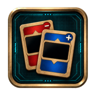
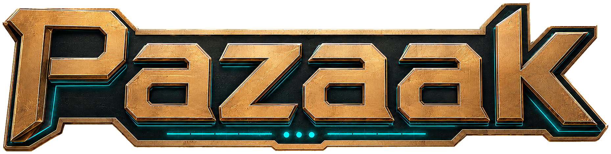

<p align="center">
  
  
</p>


A modern, responsive, and serverless web adaptation of the classic **Pazaak** card game from Star Wars franchise. Play against different AI difficulties in Single Player (Quick Match or Campaign) or challenge your friends in Peer-to-Peer Multiplayer.

No backend, no database, no registration — matches run directly in your browser.

---

## 🌟 Features

*   **🎮 Single Player Modes:**
    *   **Campaign:** Climb the AI deck ladder across 4 tiers of difficulty (Easy, Normal, Hard, Hardcore).
    *   **Quick Match:** Face a random-tier bot using a classic, flip, or mixed card pool.
*   **👥 Local Multiplayer (Pass & Play):** Play locally with a friend on a single device.
*   **🌐 Online P2P Multiplayer:**
    *   Hosted purely over WebRTC via Trystero using public torrent trackers for signaling.
    *   No server setup required: simply share your room link or code to connect instantly.
    *   Robust reconnect mechanics: if a connection drops, guest automatically resynchronizes to the host's match state.
*   **🎵 Nostalgic Audiovisuals:**
    *   Original card designs and high-fidelity graphics.
    *   Classic KotOR UI click sounds, card dealing effects, and cantina playlist.
*   **📱 Responsive & PWA Ready:** Beautifully optimized layout for both desktop and mobile browsers, installable as a progressive web app.
*   **🌍 Multi-language Support:** Full localization in both **English** and **Polish**.

---

## 🎲 Game Rules Overview

Pazaak is a black-jack style card game where the goal is to win 3 sets.
1.  **Objective:** Get your card total as close to **20** as possible without exceeding it (busting).
2.  **Gameplay:** Draw cards automatically from the main deck on your turn. You can choose to play one of your 4 side cards to adjust your score.
3.  **Actions:** Choose to **End Turn** (wait for the next card) or **Stand** (freeze your score and wait for your opponent).
4.  **Victory:** The player with the highest total score $\le 20$ wins the set. A tie results in a draw.

---

## 🛠️ Architecture & Tech Stack

This project is built client-side with **React**, **TypeScript**, **Vite**, and **Trystero**:

*   **`src/engine/`**: A faithful TypeScript implementation of the original Pazaak rules, session states, and card pools. It is transport- and UI-agnostic.
*   **`src/net/`**: Handles signaling and authoritative P2P communication powered by **Trystero** (WebRTC). The host runs the game state engine and broadcasts event streams and snapshots to the guest.
*   **`src/ui/`**: A responsive, touch-friendly UI board. Extends the original assets with modern styling, sounds, and dialog controllers.
*   **`src/music/`**: Integrates HTML5 Audio to stream, loop, and control the classic cantina music tracks.

---

## 🚀 Development & Setup

Make sure you have [Bun](https://bun.sh/) installed.

### Install dependencies
```bash
bun install
```

### Run local development server
```bash
bun run dev
```
Open [http://127.0.0.1:7443](http://127.0.0.1:7443) in your browser.

### Run tests
The test suite contains parity tests verifying the rules engine and game session states:
```bash
bun test
```

### Build for production
```bash
bun run build
```

### Lint code
```bash
bun run lint
```

---

## ⚖️ Disclaimer & Legal Notice

This is a non-profit, fan-made passion project created solely for educational and entertainment purposes. 

*   **No Affiliation:** This project is not affiliated with, authorized, endorsed by, or in any way officially connected with Disney, Lucasfilm Ltd., BioWare, Obsidian Entertainment, Electronic Arts, or any of their affiliates or subsidiaries.
*   **Ownership:** *Star Wars*, *Knights of the Old Republic*, *Pazaak*, and all associated logos, designs, card art, sounds, and names are trademarks and/or registered copyrights of Lucasfilm Ltd. and their respective intellectual property owners.
*   **Fair Use:** All assets reused from the original game are utilized under fair use guidelines for non-commercial fan creations. If you are an intellectual property owner and wish for assets to be removed, please open an issue.
